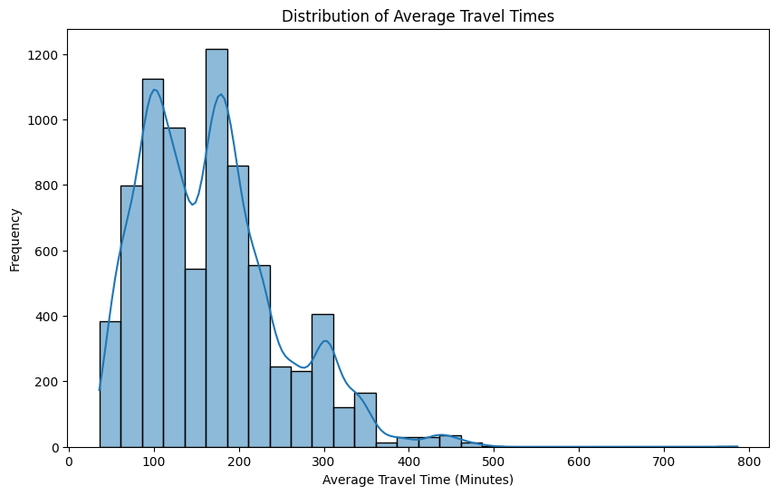
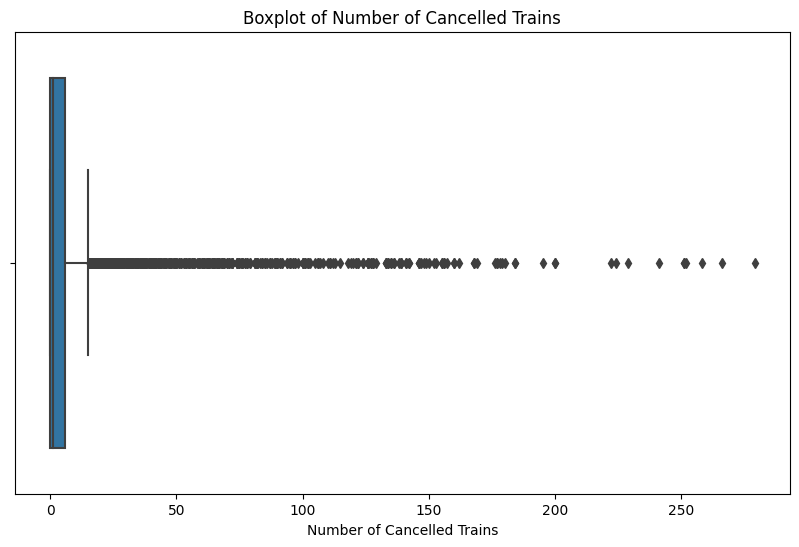
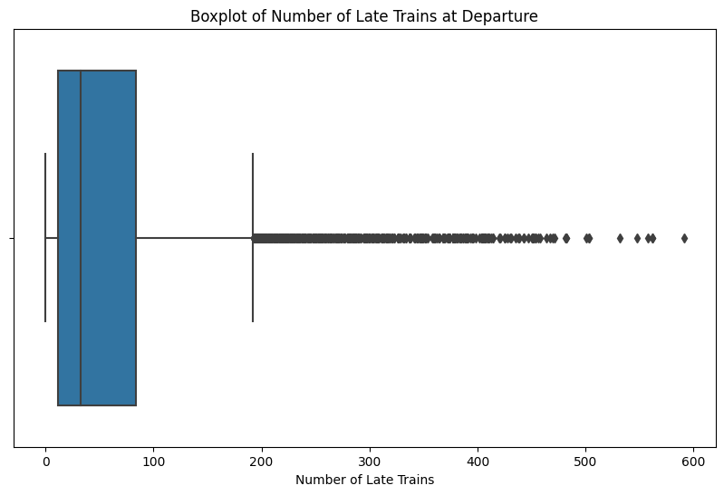
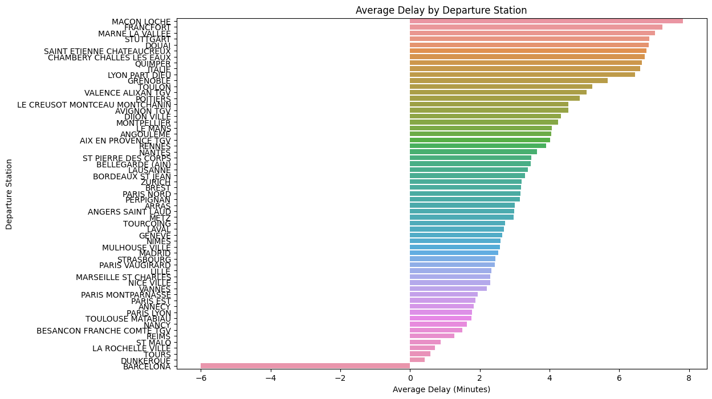
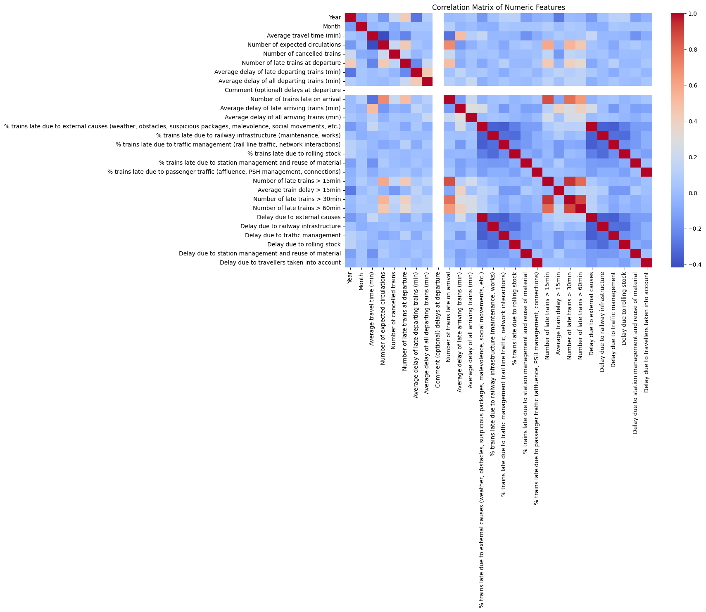
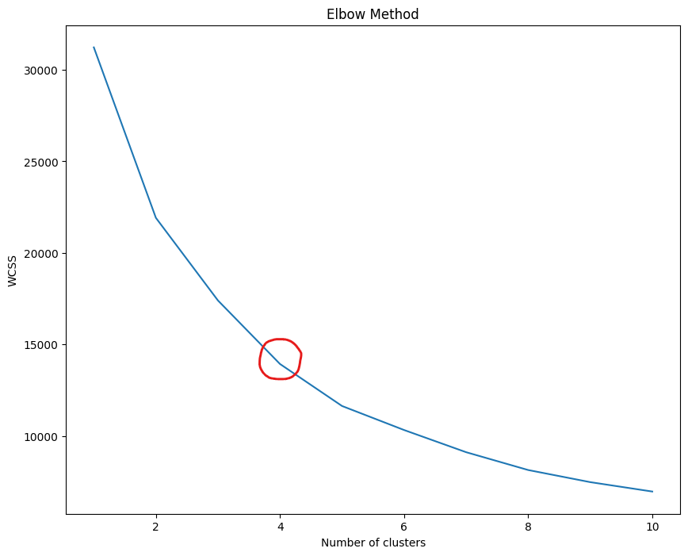
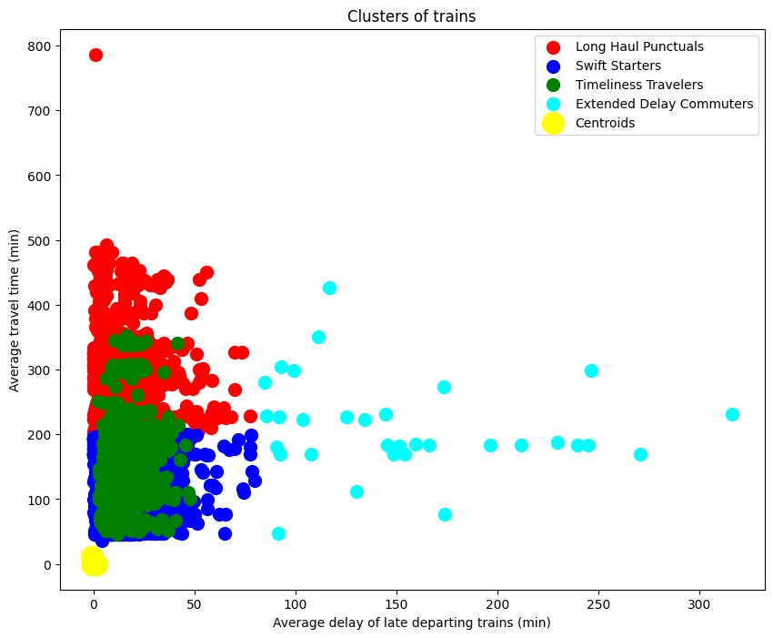

# Public Transportation Optimization through Clustering in France

## Introduction
In this project, we embarked on an analytical journey to enhance the efficiency and reliability of a public transportation system. The primary objective was to identify patterns and inefficiencies within the system, focusing on aspects such as train delays, travel times, and the punctuality of arrivals and departures. By leveraging the KMeans clustering technique, our goal was to categorize different segments of the transportation service, aiming to pinpoint specific areas that could benefit from targeted improvements.

Through a detailed data-driven approach, employing methods like the elbow method for optimal cluster determination and meticulous data normalization, we sought to uncover underlying trends and clusters within the transportation data. This project not only aimed to provide actionable insights for transportation optimization but also served as a testament to the transformative power of data analysis in operational management.
## About the Data
The dataset utilized in this project was sourced from Kaggle, specifically the ["Public Transport Traffic Data in France"](https://www.kaggle.com/datasets/gatandubuc/public-transport-traffic-data-in-france) dataset . This dataset provides a comprehensive view of the public transportation system in France, encompassing a wide array of metrics that reflect the operational dynamics of train services.

#### Dataset Overview
The dataset is rich in both breadth and depth, offering a detailed snapshot of various aspects of public transportation. Key features include:
- **Number of Late Trains (> 15min)**: This measures the count of trains experiencing significant delays.
- **Average Delay of Late Departing Trains (min)**: A metric capturing the average delay encountered by trains that departed later than scheduled.
- **Number of Trains Late on Arrival**: The total number of trains that arrived at their destination behind schedule.
- **Average Travel Time (min)**: Reflects the mean travel duration for the trains within the dataset.

These features were pivotal in our analysis, enabling us to dissect the performance of the train services across different dimensions.

#### Dataset Size and Statistics
The dataset comprises a substantial number of records, offering a robust foundation for our analysis. The size and diversity of the data ensured that our findings and insights were grounded in a comprehensive understanding of the transportation system's dynamics.

#### Data Preprocessing and Exploration
Initial steps in our project included cleaning and preprocessing the data. We handled missing values, standardized the features for uniformity, and conducted exploratory data analysis to gain preliminary insights. This phase was crucial in shaping our approach to clustering and further analysis.

#### Visualizations
Throughout the project, various visualizations were created to aid in understanding the data. These included the Elbow Method plot to determine the optimal number of clusters for KMeans, and scatter plots to visualize the resulting clusters. These visualizations not only provided clarity on the data structure but also helped in communicating our findings effectively.

In summary, the "Public Transport Traffic Data in France" dataset from Kaggle served as the backbone of our analysis, offering a detailed and comprehensive view of the public transportation system in France. The dataset's rich features and substantial size played a crucial role in enabling a deep and insightful exploration into the operational efficiencies of the train services.

The histogram above illustrates the distribution of average travel times for the public transport system under study. It appears that the travel times are concentrated in several peaks, suggesting that there may be common route lengths or that certain travel times are more frequent than others. There's a significant peak around the 100-200 minute mark, indicating a large number of routes fall within this travel time range. The long tail to the right suggests there are fewer routes with very long travel times, possibly representing longer-distance services. This visualization aids in understanding the distribution of travel times across the public transportation network, which is an essential aspect of optimizing the system's efficiency.

The boxplot provides a visual summary of the distribution of cancelled trains. It indicates the median, spread, and outliers in the data, helping to identify stations with unusually high numbers of cancellations. This can guide resource allocation for improving reliability or addressing specific issues leading to cancellations.

Similar to the boxplot for cancellations, this one focuses on the number of late trains at departure. It offers insights into the consistency of train departures across the network. Stations that show a high range or outliers might need specific attention to improve their on-time departure rates.

This horizontal bar chart presents the average delay times by departure station. It highlights the variability in punctuality across stations, with some stations consistently experiencing delays while others often depart ahead of schedule. This visualization can be instrumental in pinpointing problem areas within the network where interventions could improve overall efficiency.

The correlation matrix uses color intensity to represent the strength and direction of the relationship between different numerical features of the data set. This heat map is a powerful tool for quickly understanding how different factors relate to each other, which can be vital for building predictive models or understanding the underlying causes of delays and cancellations.

## Methods
Our project's analytical journey began with preprocessing, where we addressed missing values and normalized our dataset. Given the centrality of numeric columns in clustering, we selected features that captured the essence of public transportation performance: the number of late trains, average delays, and average travel times. We filled missing values with column means to maintain the dataset's integrity.

The KMeans clustering algorithm was at the heart of our model, and we used the Elbow method to determine the optimal number of clusters. By plotting the Within-Cluster-Sum of Squares (WCSS) against the number of clusters, we looked for the 'elbow' point where the reduction in WCSS starts to diminish, indicating the most appropriate cluster count for our data. After several iterations, we finalized four as the optimal number, providing a balance between model complexity and meaningful segmentation.

We experimented with different combinations of features and scaling methods to refine our clusters, seeking patterns that could inform actionable insights for improving public transportation systems. Each iteration offered a deeper understanding, whether through revealing overlaps between clusters or identifying outliers.

Visualizations played a crucial role, turning complex multidimensional data into comprehendible plots. The final clustering visualization offered a clear distinction between groups, aiding in the interpretation and subsequent decision-making process.

Throughout these stages, we iterated on our approach, reflecting on what worked and what didn't. We continually sought to improve our model, gaining new insights into public transportation dynamics with each step. The iterative process not only fine-tuned our model but also deepened our understanding of the data and its implications for public transportation management.

## Evaluation
The evaluation of our KMeans clustering model's performance was primarily qualitative, as clustering models do not have a definitive accuracy measure like supervised learning models. The Elbow method served as our initial evaluation tool, helping us to discern the point of diminishing returns in adding more clusters. With the Elbow plot indicating four as the optimal number of clusters, we proceeded to visualize the data.

The final cluster visualization is a key component of our evaluation. It displays a clear separation among the four clusters, each representing distinct groupings of the public transportation system's performance metrics. The clusters were named based on their defining characteristics, which were gleaned from their centroids and distribution across the features space. These names – such as "Swift Starters" for those with low delays and travel times, and "Extended Delay Commuters" for those with the highest delays – provide intuitive insights into each group's performance. If visualized in a 3D space, the "Timliness Travelers" cluster would likely exhibit clear spatial separation above the blue and red clusters, revealing the distinct group characteristics that are obscured in two dimensions.

While traditional metrics like accuracy, f1 score, and precision are not applicable, we evaluated cluster cohesion and separation to ensure meaningful groupings.

Our visualization and analysis of the clusters allowed us to answer key questions posed in the introduction. We identified patterns and anomalies in public transportation performance, such as stations consistently experiencing delays and trains that are frequently late or have longer travel times. The insights drawn from our clusters align with our goal of optimizing the public transportation system by identifying potential areas for improvement.

## Storytelling and Conclusion

## Impact

## Dataset
https://www.kaggle.com/datasets/gatandubuc/public-transport-traffic-data-in-france

